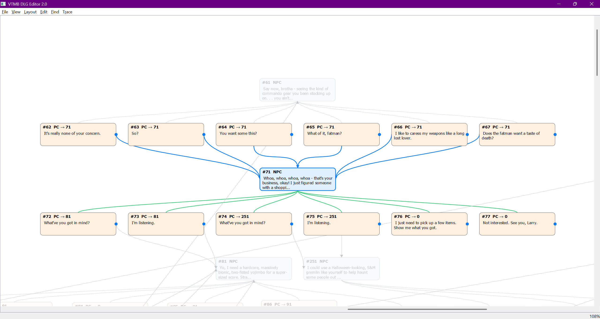

# Visual VTMB DLG Editor — Guide (EN)



An interactive **DLG** (VTMB‑compatible) dialogue editor. It renders dialogues as a **graph**:
- **Blue** edges — **PC → NPC** (player reply leads to an NPC line)
- **Green** edges — **NPC → PC** (choices offered by an NPC)

## Features
- **Tree layouts**: vertical / horizontal
- **Large graph auto‑packing**: components are placed into a **grid** (no endless width)
- **Fast linking**: “Add NPC answer…” draws **PC → new NPC** **before** the node editor pops up
- **Context highlighting**: selecting a node highlights **all** its incoming and outgoing edges (blue & green)
- **Arrow‑key navigation**:
  - Vertical: **↑** incoming, **↓** outgoing, **←/→** walk children/siblings
  - Horizontal: **←** incoming, **→** outgoing
- **Zoom & pan**: wheel, pinch, hand mode (Space/Middle mouse), “Fit to graph/width/height”
- **Autosave** every 60s (recovery file)
- Import/Export: **DLG**, **JSON**

## Setup & Run

### Dependencies
- **Python** 3.9+ (3.10–3.12 recommended)
- **PyQt5** ≥ 5.15

On Linux you may need X11/Qt runtime libs (usually pulled by PyQt5 wheels). Examples (Debian/Ubuntu): `libxcb-xinerama0`, `libxkbcommon-x11-0`.

### Install
```bash
git clone <repo-url> dlg4vtmb
cd dlg4vtmb

python -m venv .venv
# Windows: .venv\Scripts\activate
# Linux/macOS:
source .venv/bin/activate

pip install -U pip
pip install PyQt5

```

### Run
```bash
python app.py
```

## Quick tour

- **Open**: `File → Open DLG…` or `Open JSON…`
- **Save / Export**: `Save DLG…`, `Export JSON…`
- **Add node**: `Add Node…` (or node context menu)
- **Add NPC answer…** (right‑click a PC node) — **PC → NPC** edge is drawn first, then the node editor opens
- **Layouts**: `Layout: Tree (Vertical / Horizontal)` and `Layout: Sugiyama`
- **Auto Compact**: auto‑tunes gaps
- **Spacing**: `Format Spacing…` (+ hotkeys `Ctrl+[`, `Ctrl+]`)
- **Optional edges (green)**: `View → Show NPC → PC links` (toggle)
- **Empty nodes**: `View → Show Empty Nodes` (toggle)
- **Highlighting**: selecting a node highlights **all** incident edges (blue & green)
- **Arrow navigation**:
  - Vertical: **↑** incoming, **↓** outgoing, **←/→** children/siblings
  - Horizontal: **←** incoming, **→** outgoing
- **Zoom/Pan**: wheel, pinch, **Space** hand mode, **Middle mouse** pan
- **Framing**: `Fit to Graph (F)`, `Fit Width`, `Fit Height`

## Hotkeys (core)
- **Find**: `Ctrl+F`
- **Undo/Redo**: `Ctrl+Z`, `Ctrl+Y` (`Ctrl+Shift+Z`)
- **Copy/Paste/Cut/Delete**: `Ctrl+C`, `Ctrl+V`, `Ctrl+X`, `Del`
- **Add Node**: `Ctrl+N` (NPC: `Ctrl+Shift+N`, PC: `Ctrl+Shift+P`)
- **Trace to roots**: `T`
- **Zoom**: `Ctrl+=`, `Ctrl+-`, reset `Ctrl+0`
- **Fit to graph**: `F`
- **Auto Compact**: `Ctrl+Shift+F`
- **Tighten/Widen spacing**: `Ctrl+[`, `Ctrl+]`
- **Graph navigation**: arrow keys

(*Exact set may vary – consult the menus in your build.*)

## Autosave location
`<AppData>/dlg4vtmb/autosave.json` (depends on OS/user; from `QStandardPaths.AppDataLocation`).

## Source layout
- `app.py` — entry point
- `mainwindow.py` — main window, scene rebuild, highlighting, navigation, menus/actions
- `graphview.py` — `GraphView`, `GraphNode`, `GraphEdge`, `OptionEdge`
- `layout.py` — layouts (tree, grid packing), barycenter ordering
- `model.py` — `DlgRow` (dialogue data)
- `io_dlg.py` — `.dlg` read/write
- `json_conv.py` — JSON import/export

## Tips for large files
- Use **Auto Compact** and/or **Format Spacing…**
- New tree **grid‑packing** removes the “infinite width” issue
- If green edges are noisy, temporarily toggle off `Show NPC → PC links`

